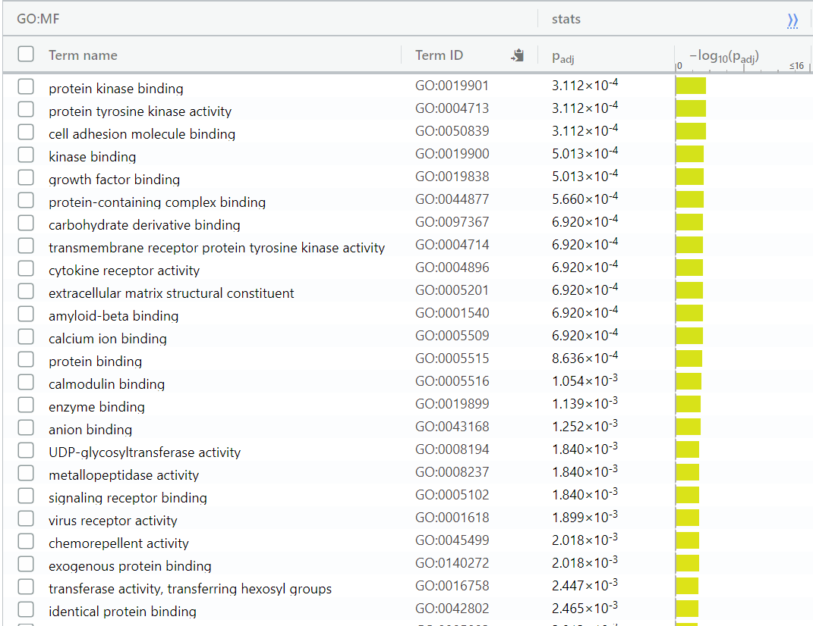
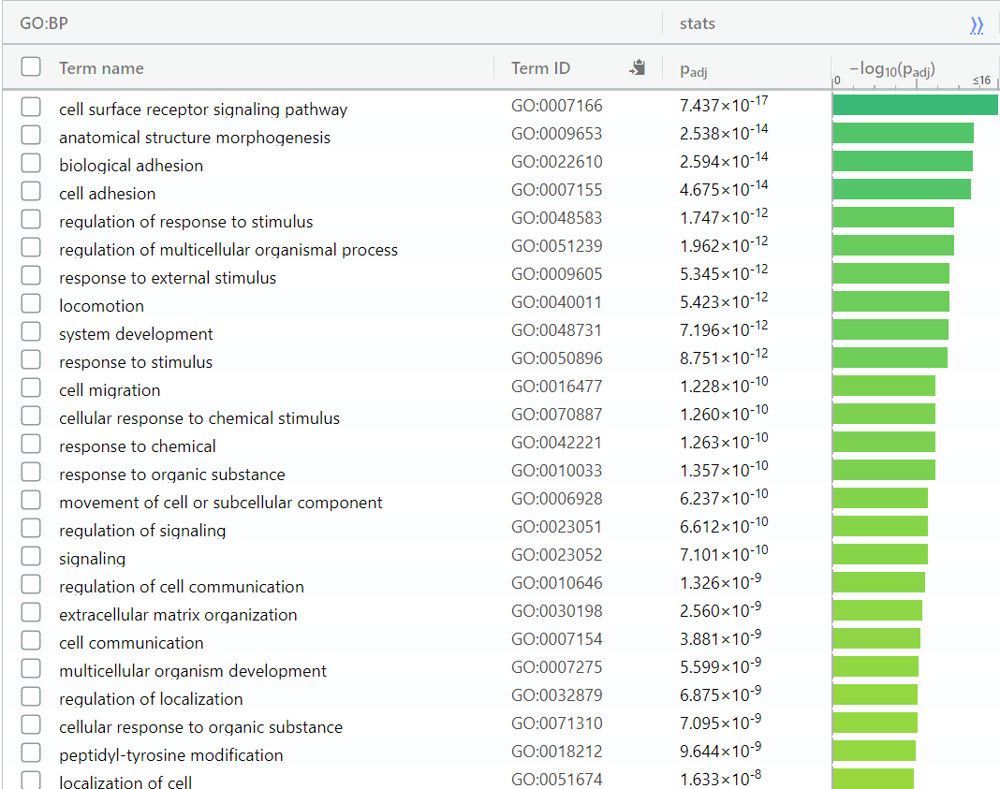
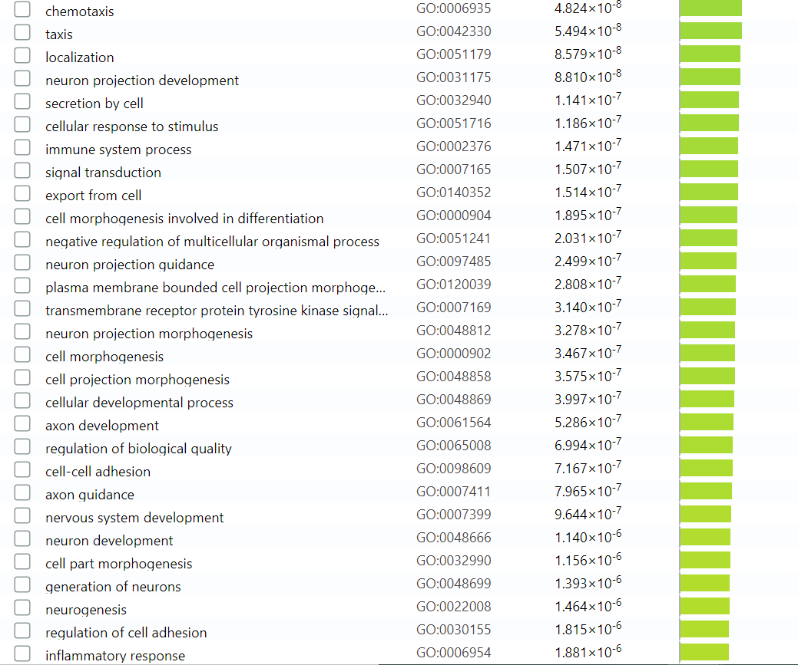
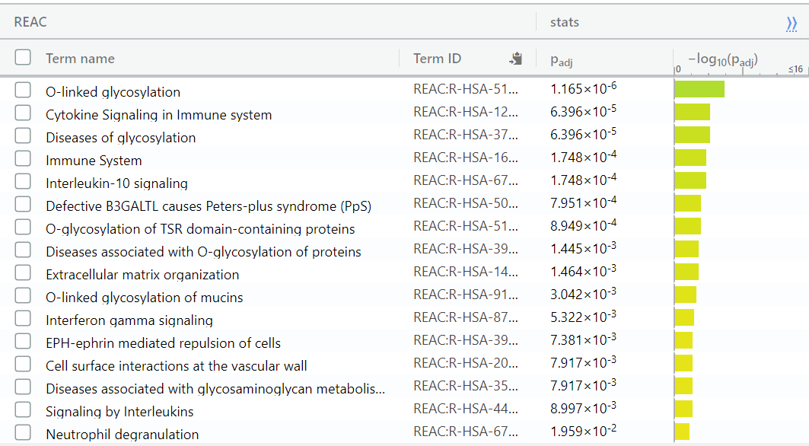
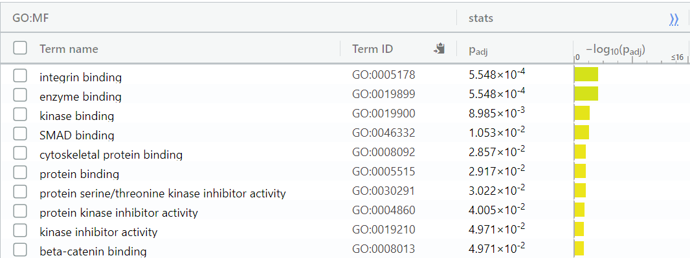
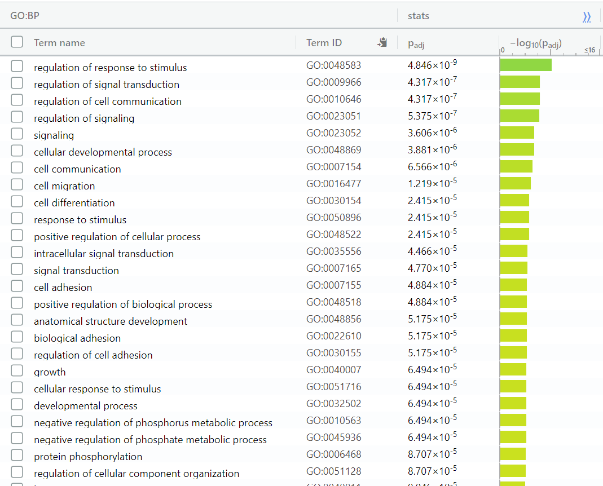
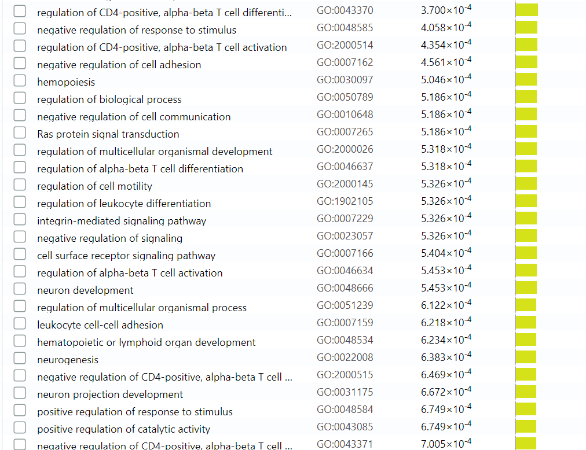

Data from: 
Lopez-Yrigoyen M, Yang CT, Fidanza A, Cassetta L et al. Genetic programming of macrophages generates an in vitro model for the human erythroid island niche. Nat Commun 2019 Feb 20;10(1):881.

# Analysis from A1
### Prepare packages required for this analysis.
```{r}
# Load Biobase.
if (! require(Biobase, quietly=TRUE)) {
  if (! exists("biocLite")) {
    source("https://bioconductor.org/biocLite.R")
  }
  biocLite("Biobase")
  library(Biobase)
}
# Load GEOquery.

if (! require(GEOquery, quietly=TRUE)) {
  if (! exists("biocLite")) {
    source("https://bioconductor.org/biocLite.R")
  }
  biocLite("GEOquery")
  library(GEOquery)
}

library(knitr)
library(edgeR)
```

### Retrieve GEO data for GSE125150.
```{r eval = TRUE, echo = TRUE}
GSE125150 <- getGEO("GSE125150", GSEMatrix = FALSE)
kable(data.frame(head(Meta(GSE125150))), format = "html")
gpl <- names(GPLList(GSE125150))[1]
gpl_info <- Meta(getGEO(gpl))
```

### Retrieve supplementary files for the differential expressions.
```{r eval = TRUE, echo = FALSE}
supp_files <- getGEOSuppFiles("GSE125150")
file_names <- rownames(supp_files)

# Expression data for KLF-1 activated and control samples:
expr <- read.table(file_names[5], header = TRUE, check.names = FALSE, sep = ',')

# Check if properly retrieved:
kable(expr[1:15,1:10], format = "html")

# Define the groups:
samples <- data.frame(lapply(colnames(expr)[8:15], FUN = function(x){unlist(strsplit(x, split = "_"))[c(2,1)]}))
colnames(samples) <- colnames(expr[8:15])
rownames(samples) <- c("Sample", "Condition")
samples <- data.frame(t(samples))
```

### Clean data if needed.
```{r eval = TRUE, echo = FALSE}
# Check to see if there are no duplicates:
gene_counts <- sort(table(expr$gene_id), decreasing = TRUE)
gene_counts[gene_counts > 1] # No duplicates

```

The data provided was thorough enough to have HGNC symbols for each gene,
so there was no need for identifier mapping.  

### Filter any uninformative or weakly expressed data after converting counts to cpm.
```{r eval = TRUE, echo = FALSE}
# Convert counts to cpm using edgeR:
dim(expr)
cpms <- cpm(expr[, 8:15])

# Name the rows by their gene names:
rownames(cpms) <- expr[, 5]

# Filter out those that don't have > 1 cpm for at least 4 samples (based on edgeR
# documentation, we want our restrictions to be based on least samples per condition 
# we have).
keep <- rowSums(cpms > 1) >= 4
expr_filtered <- expr[keep,]
```

Started with  `r dim(expr[1])[1]` genes.
Filtered down to `r dim(expr_filtered[1])[1]` genes.
 

### Plotting the density distribution of my filtered and cpm-converted data.
```{r eval = TRUE, include = TRUE, echo = FALSE}
# Make sure to run this chunk as a whole,
# as it leads to an error if run individually.
# Apply log transformation:
cpm_density <- apply(log2(cpm(expr_filtered[, 8:15])), 2, density)

# Calculate the x and y limits of samples:
xlim <- 0
ylim <- 0
for (i in 1:length(cpm_density)) {
  xlim <- range(c(xlim, cpm_density[[i]]$x));
  ylim <- range(c(ylim, cpm_density[[i]]$y))
}

cols <- rainbow(length(cpm_density))
ltys <- rep(1, length(cpm_density))

# Plot density distribution graph (initialize plot):
plot(cpm_density[[1]], xlim = xlim, ylim = ylim, type = "n", ylab = "Smoothing density of log2-CPM", main = "", cex.lab = 0.85)

# Plot lines:
for (i in 1:length(cpm_density)) lines(cpm_density[[i]], col = cols[i], lty = ltys[i])


# Legends:
legend("topright", colnames(expr_filtered[, 8:15]), col = cols, lty = ltys, cex = 0.75, border = "blue", text.col = "green4", merge = TRUE, bg = "gray90")

```
  
### Plot and compare the distribution between pre- and post-normalization.
```{r eval = TRUE, include = TRUE, echo = FALSE}
# Convert the filtered data to matrix for TMM:
filtered_data_matrix <- as.matrix(expr_filtered[, 8:15])

# Set the rownames to ensembl ids:
rownames(filtered_data_matrix) <- expr_filtered$gene_id

# Create a DGEList object, based on my data and how I want to compare those (ie. KLF-1+ vs KLF-1-):
d <- DGEList(counts = filtered_data_matrix, group = samples$Condition)

# Calculate normalization factors:
d <- calcNormFactors(d)

# Normalized data:
normalized_counts <- cpm(d)

# Compare plots of pre- vs post-normalization:
normalized_cpm_density <- apply(log2(normalized_counts), 2, density)

# Split the graph window so we can compare the plots:
# Idea based on Holts, Y. (n.d.) Split base R plot window with layout(). Retrieved from:
# https://www.r-graph-gallery.com/75-split-screen-with-layout.html.
layout(matrix(c(1, 2), ncol = 2))

xlim <- 0
ylim <- 0
for (i in 1:length(normalized_cpm_density)) {
  xlim <- range(c(xlim, normalized_cpm_density[[i]]$x));
  ylim <- range(c(ylim, normalized_cpm_density[[i]]$y))
}

cols <- rainbow(length(normalized_cpm_density))
ltys <- rep(1, length(normalized_cpm_density))

# Plot density distribution graph (initialize plot):
plot(normalized_cpm_density[[1]], xlim = xlim, ylim = ylim, type = "n", ylab = "Smoothing density of log2-CPM", main = "Post-normalization", cex.lab = 0.85)

# Plot lines for post-normalization:
for (i in 1:length(normalized_cpm_density)) lines(normalized_cpm_density[[i]], col = cols[i], lty = ltys[i])


# Legends:
legend("topright", colnames(expr_filtered[, 8:15]), col = cols, lty = ltys, cex = 0.75, border = "blue", text.col = "green4", merge = TRUE, bg = "gray90")


# Plot pre-normalization distribution:
xlim <- 0
ylim <- 0
for (i in 1:length(cpm_density)) {
  xlim <- range(c(xlim, cpm_density[[i]]$x));
  ylim <- range(c(ylim, cpm_density[[i]]$y))
}

cols <- rainbow(length(cpm_density))
ltys <- rep(1, length(cpm_density))

# Plot density distribution graph (initialize plot):
plot(cpm_density[[1]], xlim = xlim, ylim = ylim, type = "n", ylab = "Smoothing density of log2-CPM", main = "Pre-normalization", cex.lab = 0.85)

# Plot lines:
for (i in 1:length(cpm_density)) lines(cpm_density[[i]], col = cols[i], lty = ltys[i])


# Legends:
legend("topright", colnames(expr_filtered[, 8:15]), col = cols, lty = ltys, cex = 0.75, border = "blue", text.col = "green4", merge = TRUE, bg = "gray90")
```

```{r eval = TRUE, include = TRUE, echo = FALSE}
# Plot the MDS for the data after normalization:
plotMDS(d, labels = rownames(samples), col = c("darkgreen", "blue")[factor(samples$Condition)])
```

```{r eval = TRUE, include = TRUE, echo = FALSE}
# Estimate dispersion:
model_design <- model.matrix(~samples$Sample + samples$Condition+0)
d <- estimateDisp(d, model_design)
# Plot the graph for BCV:
plotBCV(d, col.tagwise = "black", col.common = "red")

plotMeanVar(d, show.raw.vars = TRUE, show.tagwise.vars = TRUE, NBline = TRUE,
            show.ave.raw.vars = TRUE, show.binned.common.disp.vars = TRUE)
```

### Save the data.
```{r}
# Convert back to data.frame so that we can associate gene names with the counts again, because
# matrices cannot hold strings and numerics together.

a <- as.data.frame(normalized_counts)
b <- c("gene_id", colnames(a))
normalized_counts <- merge(expr_filtered[c(2, 5)], cbind(rownames(a), a), by.x="gene_id", by.y="rownames(a)")

write.table(normalized_counts, "~/GSE125150_normalized_counts.txt", sep = "\t")
```

# Analysis for A2

## Introduction
In the previous assignment, data was retrieved from GEO with the id GSE125150. This data is explores how KLF-1 
expression affects macrophage function during the maturation of erythrocyte, in humans.
After the raw gene count data underwent conversion to cpm, any uninformative or weakly expressed genes were omitted.
Then, the cleaned data was normalized using log2(cpm) and further analysis with MDS plot and mean-variance relationship
showed that the samples clustered based on treatment (KLF-1+ vs. KLF-1-) and that the data followed a negative binomial
 distribution. After cleaning and normalization, the dataset was reduced to 13872 genes starting from 60675.

## Differential Expression Analysis

### Prepare packages required for this analysis.
```{r echo = FALSE}
# Load Biobase.
if (! require(Biobase, quietly=TRUE)) {
  if (! exists("biocLite")) {
    source("https://bioconductor.org/biocLite.R")
  }
  biocLite("Biobase")
  library(Biobase)
}
# Load GEOquery.

if (! require(GEOquery, quietly=TRUE)) {
  if (! exists("biocLite")) {
    source("https://bioconductor.org/biocLite.R")
  }
  biocLite("GEOquery")
  library(GEOquery)
}

library(knitr)
library(edgeR)
```


### Load normalized data from previous assignment.
```{r echo = FALSE}
normalized_count_data <- read.table(file=file.path("~/GSE125150_normalized_counts.txt"))
# Check if data imported correctly:
normalized_count_data[1:5,1:5]

```


### Prepare for creating a heatmap and downstream analysis.
```{r echo = FALSE}
# Converting to matrix, because we have a data.frame:
heatmap_matrix <- normalized_count_data[,3:ncol(normalized_count_data)]
rownames(heatmap_matrix) <- normalized_count_data$gene_id
colnames(heatmap_matrix) <- colnames(normalized_count_data[,3:ncol(normalized_count_data)])
heatmap_matrix

library(ComplexHeatmap)
library(circlize)

# Create a heat map
if(min(heatmap_matrix) == 0){
    heatmap_col = colorRamp2(c( 0, max(heatmap_matrix)), c( "white", "red"))
  } else {
    heatmap_col = colorRamp2(c(min(heatmap_matrix), 0, max(heatmap_matrix)), c("blue", "white", "red"))
  }
current_heatmap <- Heatmap(as.matrix(heatmap_matrix),
                               show_row_dend = TRUE,
                               show_column_dend = TRUE, 
                               col=heatmap_col,
                               show_column_names = TRUE, 
                               show_row_names = FALSE,
                               show_heatmap_legend = TRUE
                               )


# Apply row-normalization
# Subtract the mean from each value and divide by the standard dev of the row to get row-normalization
# (scale() function does this for us).
heatmap_matrix <- t(scale(t(heatmap_matrix)))
if(min(heatmap_matrix) == 0){
    heatmap_col = colorRamp2(c( 0, max(heatmap_matrix)), c( "white", "red"))
  } else {
    heatmap_col = colorRamp2(c(min(heatmap_matrix), 0, max(heatmap_matrix)), c("blue", "white", "red"))
  }
current_heatmap <- Heatmap(as.matrix(heatmap_matrix),
                               show_row_dend = TRUE,
                               show_column_dend = TRUE, 
                               col=heatmap_col,
                               show_column_names = TRUE, 
                               show_row_names = FALSE,
                               show_heatmap_legend = TRUE
                               )

# Roughly, our data clusters based on treatment (KLF-1+ or KLF-1-), also shown by the MDS plot in A1.
plotMDS(heatmap_matrix, labels = rownames(samples), col = c("darkgreen", "blue")[factor(samples$Condition)])
```


### Create a model, calculate p-values, and apply multiple hypothesis testing.
```{r echo = FALSE}
# Define groups:
samples <- data.frame(
        lapply(colnames(normalized_count_data)[3:10],
               FUN=function(x){
                 unlist(strsplit(x, split="_"))[c(2,1)]}))
colnames(samples) <- colnames(normalized_count_data)[3:10]
rownames(samples) <- c("sample", "treatment")
samples <- data.frame(t(samples))
samples

# Create data matrix
model_design <- model.matrix(~ samples$treatment)
kable(model_design, type="html")
expression_matrix <- as.matrix(normalized_count_data[,3:10])
rownames(expression_matrix) <- normalized_count_data$gene_id
colnames(expression_matrix) <- colnames(normalized_count_data)[3:10]
minimal_set <- ExpressionSet(assayData=expression_matrix)

# Fit the data to our linear model
fit <- lmFit(minimal_set, model_design)

# Apply empirical Bayes to compute differential expressions for the model
fit2 <- eBayes(fit,trend=TRUE)

topfit <- topTable(fit2, 
                   coef=ncol(model_design),
                   adjust.method = "BH",
                   number = nrow(expression_matrix))

# Merge gene names to topfit table
output_hits <- merge(normalized_count_data[,1:2],
                     topfit,
                     by.y=0,by.x=1,
                     all.y=TRUE)
# Sort by pvalue
output_hits <- output_hits[order(output_hits$P.Value),]
output_hits
# Check the results
kable(output_hits[1:10,],type="html")

length(which(output_hits$P.Value < 0.01))
length(which(output_hits$adj.P.Val < 0.01))
```
For Multiple Hypothesis Testing, I used the BH method. According to the documentation and literature, BH method 
controls for the false discovery rate (a less stringent condition than family-wise error rate) and therefore is a more
powerful method than those that control for family-wise error rate. My dataset allows many genes to pass even with the 
stringent condition (with BH), so I decided to use BH.
Before correction, 2841 genes passed a cutoff of 0.01, and after correction with the BH method, 1337 genes passed.
With a cutoff of 0.05, there were 2859 (after correction) and I considered this as excessive, so I decided to make the cutoff more strict.
I could have made the cutoff higher to 0.001; however, I was afraid I would disregard interesting genes, so I kept
the cutoff at 0.01 as it is a generally accepted p-value for high significance.

### Create heat map based on p-value cutoff.
```{r echo = FALSE, results = 'hide'}

top_hits <- output_hits$gene_id[output_hits$adj.P.Val<0.01]
top_hits
heatmap_matrix_tophits <- t(
  scale(t(heatmap_matrix[
    which(rownames(heatmap_matrix) %in% top_hits),])))
if(min(heatmap_matrix_tophits) == 0){
    heatmap_col = colorRamp2(c( 0, max(heatmap_matrix_tophits)), 
                             c( "white", "red"))
  } else {
    heatmap_col = colorRamp2(c(min(heatmap_matrix_tophits), 0, max(heatmap_matrix_tophits)), c("blue", "white", "red"))
  }
current_heatmap <- Heatmap(as.matrix(heatmap_matrix_tophits),
                           cluster_rows = TRUE,
                           cluster_columns = TRUE,
                               show_row_dend = TRUE,
                               show_column_dend = TRUE, 
                               col=heatmap_col,
                               show_column_names = TRUE, 
                               show_row_names = FALSE,
                               show_heatmap_legend = TRUE,
                               )
current_heatmap

```

Based on the heatmap, the conditions (KLF-1+ vs. KLF-1-) cluster together. All the samples in KLF-1+ (K2PT) share 
similar differential expression profiles and all the samples in KLF-1- (K2MT) share similar differential expression 
profiles.

## ORA

### Retrieve thresholded list for upregulated and downregulated genes
```{r echo = FALSE}
output_hits[,"rank"] <- -log(output_hits$adj.P.Val,base =10) * sign(output_hits$logFC)
output_hits <- output_hits[order(output_hits$rank),]

upregulated_genes <- output_hits$gene_name[
  which(output_hits$adj.P.Val < 0.01 
             & output_hits$logFC > 0)]

downregulated_genes <- output_hits$gene_name[
  which(output_hits$adj.P.Val < 0.01 
             & output_hits$logFC < 0)]

upregulated_genes[1:10]
downregulated_genes[1:10]

write.table(x=upregulated_genes,
            file=file.path("KLF1_upregulated_genes.txt"),sep = "\t",
            row.names = FALSE,col.names = FALSE,quote = FALSE)

write.table(x=downregulated_genes,
            file=file.path("KLF1_downregulated_genes.txt"),sep = "\t",
            row.names = FALSE,col.names = FALSE,quote = FALSE)


```


### ORA with g:Profiler
The extracted genes were put through g:Profiler for ORA. g:Profiler was used because of its easy manipulation.
The following options were used.
Significance threshold: Benjamini-Hochberg (Again, because of its powerfulness due to its stringence.)
User threshold: 0.05
Annotation sources: GO molecular function, GO biological process, Reactome, WikiPathways
(These sources were used because we want to know the mechanism of action behind the effect of KLF1+ macrophages
on the maturation of erythrocytes, and what kinds of pathways may be involved for this maturation to occur. Other 
sources, like GO cellular component, were not relevant because we are interested in a broader picture on the pathways 
and processes)

Below are the images of related terms for the upregulated genes:

```{r}








```

### Interpretations
The results of this analysis broadly supports the original paper's conclusion, in that KLF-1 induction does lead to differentiation to macrophages that are involved in erythrocyte maturation. The result of g:Profiler shows that upregulated genes are involved in immune system processes, as well as cell-cell adhesion and communication. Also, protein kinase activity seems to be upregulated, and this makes sense because kinases are often related with signalling pathways and activations. Interestingly, these genes are also involved in neuronal processes which could potentially unveil interesting relationships between immune cells that are resident in umbilical cords vs. near neurons. Furthermore, the downregulated genes appear to be involved in kinase inhibition, which corresponds to the upregulated genes. One interesting process that is shown to be downregulated in KLF-1+ macrophages is the regulation of CD4 T cells. This could possibly be due to the fact that these macrophages are obligates to helping the maturation of erythrocytes.

# References
Lopez-Yrigoyen M, Yang CT, Fidanza A, Cassetta L et al. Genetic programming of macrophages generates an in vitro model for the human erythroid island niche. Nat Commun 2019 Feb 20;10(1):881.

Ritchie ME, Phipson B, Wu D, Hu Y, Law CW, Shi W, Smyth GK (2015). “limma powers differential expression analyses for RNA-sequencing and microarray studies.” Nucleic Acids Research, 43(7), e47. doi: 10.1093/nar/gkv007.

Robinson MD, McCarthy DJ, Smyth GK (2010). “edgeR: a Bioconductor package for differential expression analysis of digital gene expression data.” Bioinformatics, 26(1), 139-140. doi: 10.1093/bioinformatics/btp616.

Uku Raudvere, Liis Kolberg, Ivan Kuzmin, Tambet Arak, Priit Adler, Hedi Peterson, Jaak Vilo: g:Profiler: a web server for functional enrichment analysis and conversions of gene lists (2019 update) Nucleic Acids Research 2019; doi:10.1093/nar/gkz369