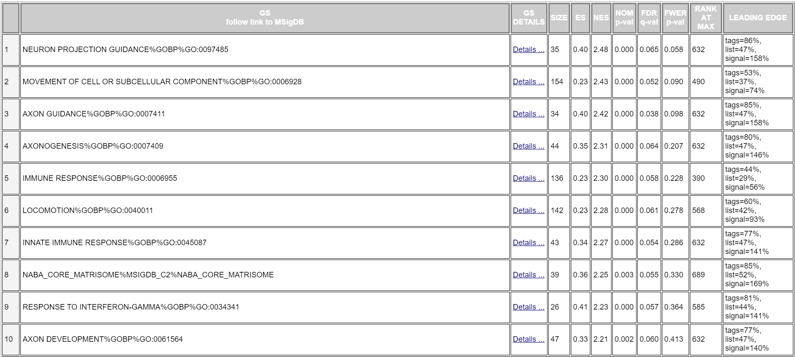
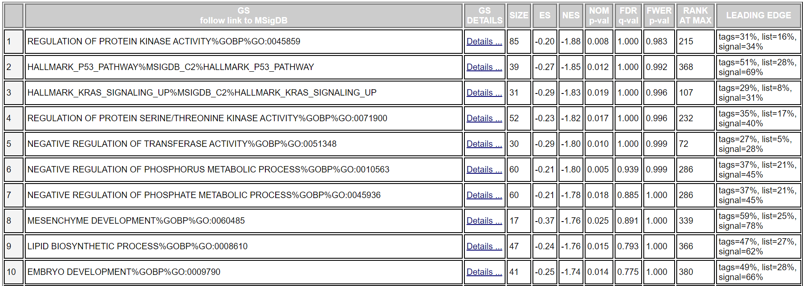
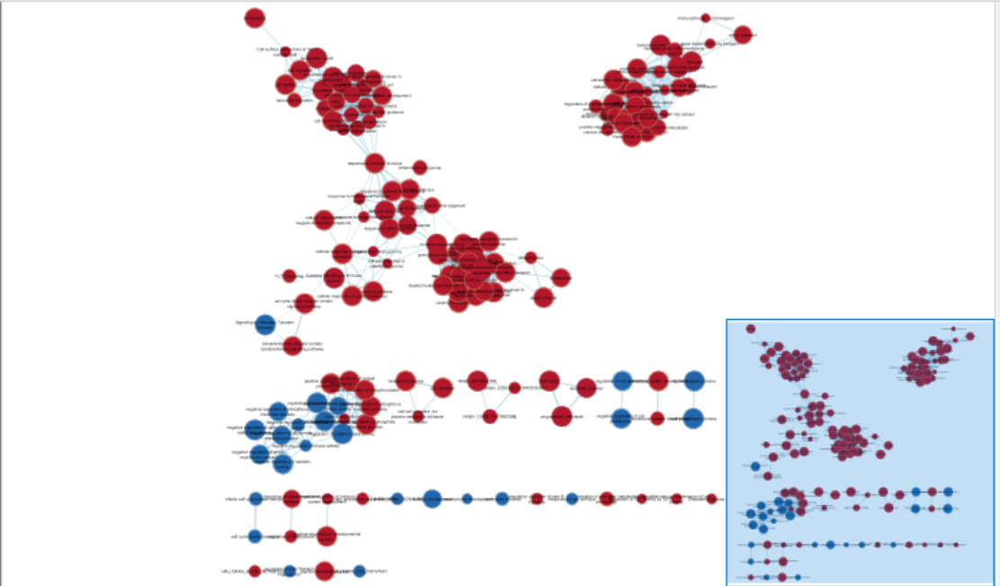
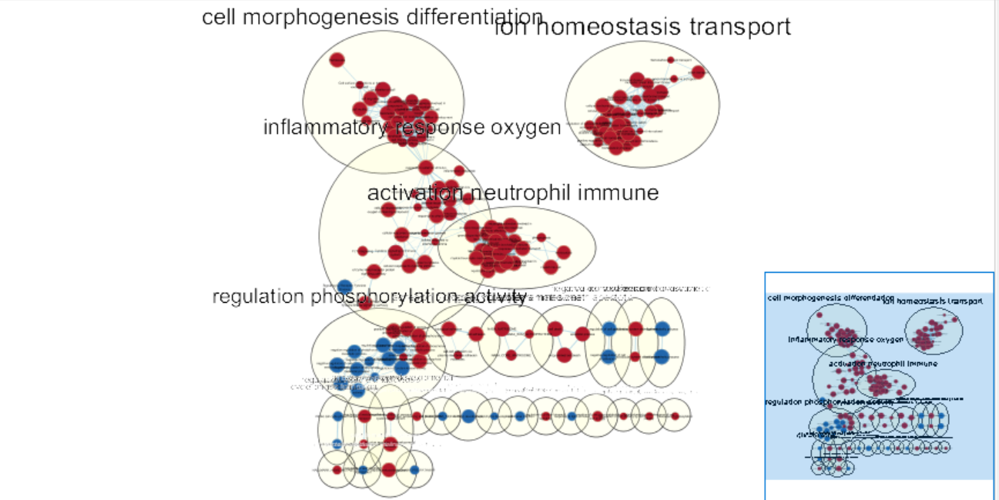
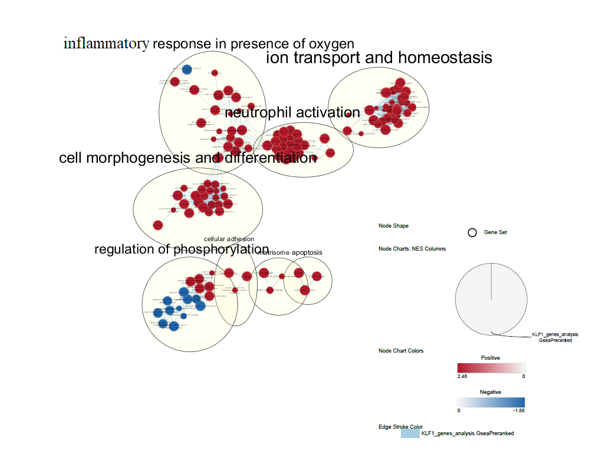
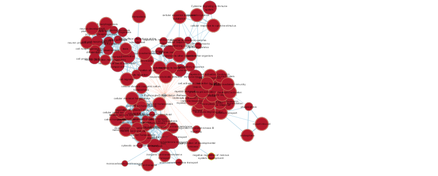

```{r child = 'A2.Rmd'}
```

# Gene Set Enrichment Analysis
## Extract gene list and ranks for .rnk file
```{r}
# Filter to only significant genes
output_hits_filtered <- (subset(output_hits, 
                           output_hits$adj.P.Val < 0.01))

# Flip order because rank is in ascending order
output_hits_desc <- output_hits_filtered[nrow(output_hits_filtered):1, ]

# Write only the second(gene name) and ninth(rank) columns. 
write.table(x=output_hits_desc[c(2,9)],
            file=file.path("KLF1_genelist.rnk"),sep = "\t",
            row.names = FALSE,col.names = FALSE,quote = FALSE)

# Top 10 genes and ranks.
kable((output_hits_desc[c(2,9)])[1:10,], format = "html")
```

## Run GSEA
GSEA 4.0.3 was used.
Geneset was retrieved from http://download.baderlab.org/EM_Genesets/current_release/Human/symbol/.
Because we want the latest GO biological processes and do not want anything inferred from IEA, Human_GOBP_AllPathways_no_GO_iea_April_01_2020_symbol.gmt was used.
The following parameters were used:
- No collapse
- Max size 200
- Min size 15
- Everything else as default.

Below are the top 10 enriched gene sets from upregulated and downregulated
genes, respectively.
```{r}


```

Based on these lists, the upregulated genes are enriched in neuron projection guidance, which suggests that the genes are involved in neuron development. Furthermore, other top gene sets are also involved in CNS development, such as axon development. These are known results from previous research, for example by Moore, Apara and Goldberg (2011), where KLF genes are transcription factors involved in neuron growth and axon regeneration. Furthermore, Bieker, Ouyang and Chen (1998) also state that among the KLF genes, post-translational phosphorylation of KLF1 allows it to bind beta-globin promotor in erythroid cell lines that do not express beta-globin yet. To support this, the 15th gene set (not shown in figure above) related to positive regulation of tyrosine-peptidyl phosphorylation.
Also, a few of the top gene sets appear to be involved in immune cells and function. 
The downregulated genes are enriched in regulation of protein kinase activity. We cannot conclude if this is allowing phosphorylation of KLF-1 since the geneset term is not specific enough in stating whether it positively or negatively regulates kinase activity.

The stats associated with neuron projection guidance are:
- ES = 0.4
- NES = 2.48
- FDR = 0.065
- 31 genes in leading edge
- Top gene: EFNB1; Receptor tyrosine kinase involved in migration, repulsion and adhesion during neuronal, vascular and epithelial development.

The stats associated with regulation of protein kinase activity are:
- ES = -0.2
- NES = -1.88
- FDR = 1.000
- 59 genes in leading edge
- Top gene: MAP3K6 in the MAP kinase signal transduction

Compared to the analysis in A2, the gene set results are more specific to neuronal and axonal growth, rather than general cell binding activity. I think these results can be compared because regardless of thresholded or nonthresholded, the scores observed among the genes prior to gene set enrichment analysis are very good, and therefore the thresholds do not affect the gene list much. With that being said, the thresholds are arbitrary while GSEA uses a non-thresholded approach, being fair by including all genes. So, although I say that they can be compared, I think the nonthresholded analysis would yield a more robust result.

# Enrichment Map
For the following steps, Cytoscape 3.7.2 was used, along with its Apps.

## Initial Enrichment Map production
The GSEA results were imported into Cytoscape using the Enrichment Map App.
The FDR q-value cutoff was set to 0.1 (initially 0.01 but did not allow any to pass). Even then, this only allowed < 30 terms so instead a p-value cutoff of 0.05 was used. Below is the initial enrichment map.
```{r}

```

AutoAnnotate App was used to annotate the EM, using Community Cluster and Word Cloud: Adjacent Words. The default MCL cluster did not work and other methods were not as informative as Community Cluster.
Below is the annotated enrichment map.
```{r}

```

The clusters were filtered down to only those containing >3 terms.
Below is the filtered annotated enrichment map, with a legend.
```{r}

```


The clusters were collapsed to create a themed enrichment map.
The major themes highlighted here are:
- neutrophil activation, inflammatory response in presence of oxygen, cell morphogenesis and differentiation (likely related to immune cells)
- regulation of phosphorylation
- ion transport and homeostasis
- cell adhesion
- matrisome
- apoptosis
These themes mildly fit with the model, where KLF-1 in macrophage is contributing to creating an erythroblastic island niche. Although the analysis is not suggesting anything as specific as the model, it does suggest how KLF-1 is involved in cell morphogenesis, likely of immune cells, since the cluster is connected to the inflammatory response cluster.
Based on this EM, an interesting and novel pathway seen is neutrophil activation. As far as I have researched for papers, there were no direct KLF-1 activity associated with neutrophil activation. 

# Interpretation
1. Do the enrichment results support conclusions or mechanism discussed in the original paper? How do these results differ from the results you got from Assignment #2 thresholded methods?  
Partially. This result suggests how KLF-1 could be involved in cell morphogenesis of immune cells, but does not go as far to suggest which immune cells it plays a role in, aside from neutrophils (which is not the conclusion discussed in the paper). Based on the specific GO BP terms in the EM, the analysis more so supports that KLF-1 plays a role in cell morphogenesis of neuronal cells, instead of erythrocytes.  
Moreover, these results were much more specific compared to Assignment 2, where results were not specific for immune cells and more geared towards neurons. The rest were quite similar, for example, capturing terms associated with protein kinase activity and cell adhesion.

2. Can you find evidence, i.e. publications, to support some of the results that you see. How does this evidence support your result?  
Yes. As stated previously in this report, Moore, Apara and Goldberg (2011) have concluded that the KLF family of transcription factors are involved in neurite outgrowth and axon regeneration, which are directly related to what we have observed in our enrichment map, under the cell morphogenesis theme. Furthermore, Bieker, Ouyang and Chen (1998) have shown that KLF-1, upon phosphorylation, allows transcription of beta-globin, in erythroid cell lines that have not yet expressed beta-globin. The enrichment map has a 'regulation of phosphorylation' theme, with many terms relating to positive regulation associated with KLF-1+ cells. Therefore, results from Bieker, Ouyang and Chen support the results seen here.

# Post-Analysis
After enrichment analysis, my results seemed quite close to those that were achieved by the original publication. One thing that lacked in my results was specificity for erythrocytes, so I decided to explore this further to see if I could possibly get closer to the results from the original publication. Therefore, I selected the erythrocyte differentiation pathway signature set from MSigDB. By using this for post analysis, I figured that I could arrive at a more confident conclusion on whether my results are in line with the original publication. 

The gene set I have selected is BIOCARTA_ERYTH_PATHWAY, from MSigDB (https://www.gsea-msigdb.org/gsea/msigdb/geneset_page.jsp?geneSetName=BIOCARTA_ERYTH_PATHWAY&keywords=erythrocyte).

I imported this into the main enrichment map that I generated and below is the post-analysis enrichment map. I've set the parameters to Mann-Whitney (One-sided Greater) because I want the erythrocyte differentiation genes to be expressed at the top end genes in my dataset. Unfortunately, the statistical values were not significant (although almost significant), so the cutoff was set to 0.15 instead of the ideal 0.05.
```{r}

```

This post analysis shows that indeed many of the genes expressed in KLF-1+ macrophages are related to erythrocyte differentiation, which supports the findings made by the original study. Therefore, although not confident due to insignificant statistical values, we can say that the genes are likely involved in inflammatory responses and cell morphogenesis for erythrocytic cell lines, and neutrophil activation could play an important role in differentiation of erythrocytes. 
* The original network was subsetted to include only the nodes from clusters with >3 terms, in the post analysis. 

# References
Ouyang L, Chen X, Bieker JJ. Regulation of erythroid Krüppel-like factor (EKLF) transcriptional activity by phosphorylation of a protein kinase casein kinase II site within its interaction domain. J Biol Chem. 1998 Sep 4;273(36):23019-25.

Isserlin et al. Enrichment Map – a Cytoscape app to visualize and explore OMICs pathway enrichment results. F1000Res. 2014; 3:141.

Kucera et al. AutoAnnotate: A Cytoscape app for summarizing networks with semantic annotations. F1000Res. 2016 July 15;5:1717.

Liberzon et al. Molecular signatures database (MSigDB) 3.0. Bioinformatics. 2011 June 15;27(12):1739-40.

Lopez-Yrigoyen M, Yang CT, Fidanza A, Cassetta L et al. Genetic programming of macrophages generates an in vitro model for the human erythroid island niche. Nat Commun 2019 Feb 20;10(1):881.

Montojo et al. GeneMANIA Cytoscape plugin: fast gene function predictions on the desktop. Bioinformatics. 2010 Nov 15;26(22):2927-2928.

Moore DL, Apara A, and Goldberg JL. Krüppel-like transcription factors in the nervous system: novel players in neurite outgrowth and axon regeneration. Mol Cell Neurosci. 2011 Aug;47(4):233-43.

Morris et al. clusterMaker: a multi-algorithm clustering plugin for Cytoscape. BMC Bioinformatics. 2011 November 9;12(436).

Oesper et al. WordCloud: a Cytoscape plugin to create a visual semantic summary of networks. Source Code Biol Med. 2011 April 7;6:7.

Shannon et al. Cytoscape: A Software Environment for Integrated Models of Biomolecular Interaction Networks. Genome Res. 2003 Nov;13(11):2498-504.

Subramanian et al. Gene set enrichment analysis: a knowledge-based approach for interpreting genome-wide expression profiles. Proc Natl Acad Sci USA. 2005 Oct 25;102(43):15545-50.

Ritchie ME, Phipson B, Wu D, Hu Y, Law CW, Shi W, Smyth GK (2015). “limma powers differential expression analyses for RNA-sequencing and microarray studies.” Nucleic Acids Research, 43(7), e47. doi: 10.1093/nar/gkv007.

Robinson MD, McCarthy DJ, Smyth GK (2010). “edgeR: a Bioconductor package for differential expression analysis of digital gene expression data.” Bioinformatics, 26(1), 139-140. doi: 10.1093/bioinformatics/btp616.

Uku Raudvere, Liis Kolberg, Ivan Kuzmin, Tambet Arak, Priit Adler, Hedi Peterson, Jaak Vilo: g:Profiler: a web server for functional enrichment analysis and conversions of gene lists (2019 update) Nucleic Acids Research 2019; doi:10.1093/nar/gkz369